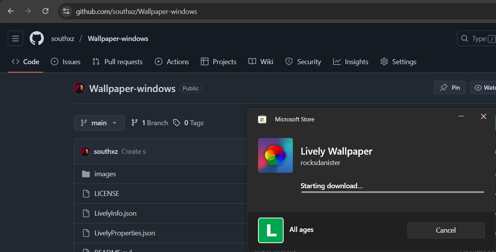
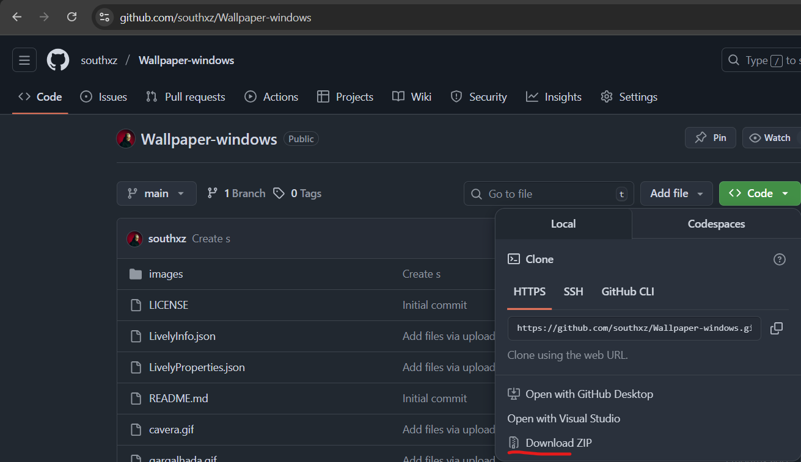
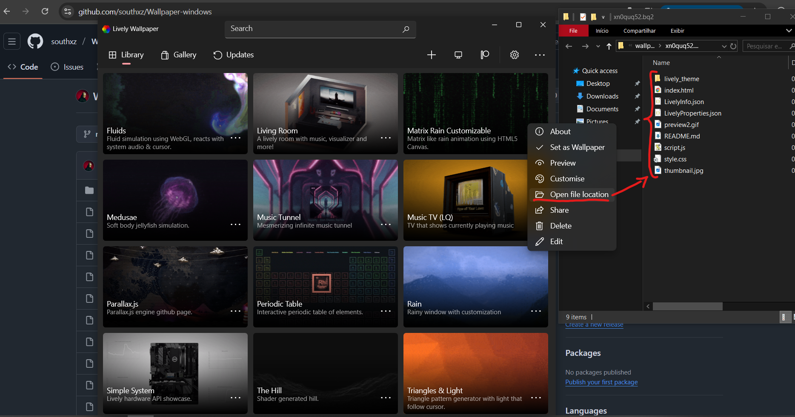
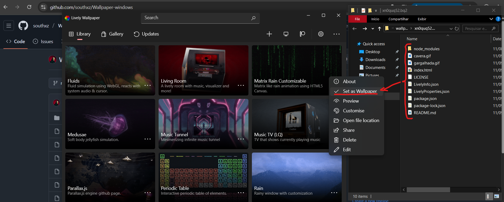

# Wallpaper Hacker 
wallpaper for windows, with interactive hacker theme - using lively wallpaper

This project offers an animated hacker-themed wallpaper for Windows, fully compatible with **Lively Wallpaper**.
Ideal for those seeking a dynamic, modern, and hacker-inspired look on their desktop.

# How to use  
> 1. [Install Lively Wallpaper](https://apps.microsoft.com/detail/9ntm2qc6qws7)  
- 
 
> 2. Download the files for this project.  
- 
 
> 3. Open Lively → Select Matrix Rain Customizable → Open file location  
- 3.1 Delete all files from the directory.  
- 3.2 Extract the project files to the directory, and unpack `node_modules`.  
- 
 
> 4. Apply the wallpaper  
- 4.1 In the `Lively app`, click on Set as Wallpaper.  
- 
 
> 5. Enjoy your hacker-style live wallpaper!  
- 
